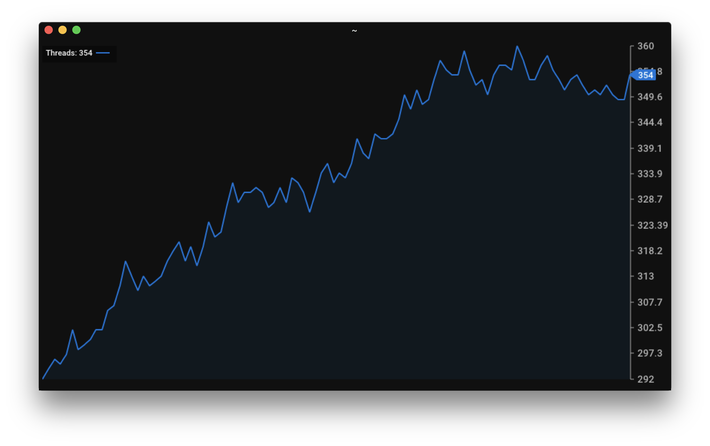
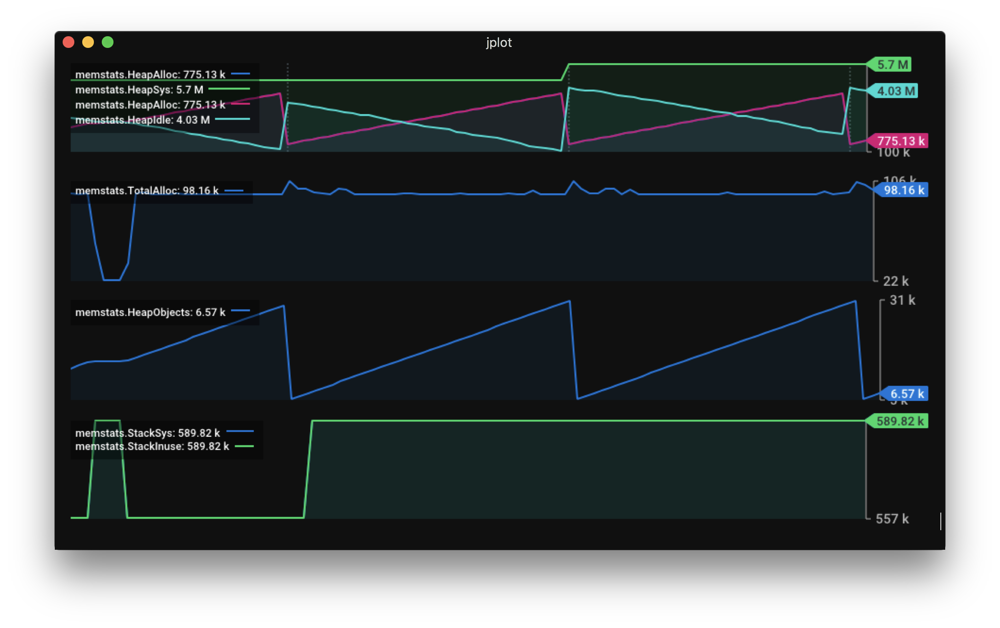

# jplot
[](https://godoc.org/github.com/rs/jplot) [](https://raw.githubusercontent.com/rs/jplot/master/LICENSE) [](https://travis-ci.org/rs/jplot)

Jplot tracks expvar-like (JSON) metrics and plot their evolution over time right into your iTerm2 terminal.


## Install

```
go get -u github.com/rs/jplot
```

This tool does only work with [iTerm2](https://www.iterm2.com).

## Usage

Given the following JSON output:

```
{
    "mem": {
        "Heap": 1234,
        "Sys": 4321,
        "Stack": 203
    },
    "cpu": {
        "STime": 123,
        "UTime":1234
    },
    "Threads": 2
}
```

You can graph the number of thread over time:

```
jplot --url http://:8080/debug/vars Thread
```



Or create a graph with both Utime and Stime growth rate on the same axis by using `+` between two field paths:

```
jplot --url http://:8080/debug/vars counter:cpu.STime+counter:cpu.UTime
```

Note: the `counter:` prefix instructs jplot to compute the difference between the values instead of showing their absolute value.


Or create several graphs by providing groups of fields as separate arguments; each argument creates a new graph:

```
jplot --url http://:8080/debug/vars mem.Heap+mem.Sys+mem.Stack counter:cpu.STime+cpu.UTime Threads
```


See [gojq](github.com/elgs/gojq) for more details on the JSON query syntax.

### Memstats

Here is an example command to graph a Go program memstats:

```
jplot --url http://:8080/debug/vars \
    memstats.HeapSys+memstats.HeapAlloc+memstats.HeapIdle \
    counter:memstats.TotalAlloc \
    memstats.HeapObjects
```



