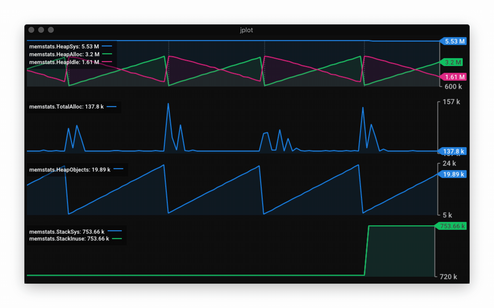
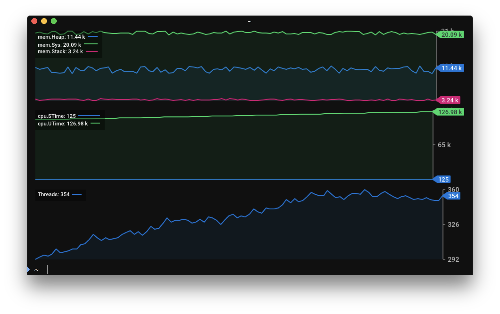

# jplot
[](https://godoc.org/github.com/rs/jplot) [](https://raw.githubusercontent.com/rs/jplot/master/LICENSE) [](https://travis-ci.org/rs/jplot)

Monitor JSON metrics right into iTerm2 terminal. Jplot read JSON objects from its standard input, and plot the values specified as argument.



## Install

```
go get -u github.com/rs/jplot
```

This tool does only work with [iTerm2](https://www.iterm2.com).

## Usage

Given the following input (one JSON object per line and per second):

```
{"mem": {"Heap": 1234, "Sys": 4321, "Stack": 203}, "cpu": {"STime": 123, "UTime":1234}, "Threads": 2}
{"mem": {"Heap": 1222, "Sys": 4123, "Stack": 203}, "cpu": {"STime": 234, "UTime":1442}, "Threads": 5}
{"mem": {"Heap": 1123, "Sys": 4002, "Stack": 203}, "cpu": {"STime": 345, "UTime":1567}, "Threads": 3}
...
```

You can graph the number of thread over time:

```
producer | jplot Thread
```


Or create a graph with both Utime and Stime growth rate on the same axis:

```
producer | jplot counter:cpu.STime+counter:cpu.UTime
```


Or create several graphs:

```
producer | jplot mem.Heap+mem.Sys+mem.Stack counter:cpu.STime+cpu.UTime Threads
```



The `producer` can be implemented as follow:

```
while true; do curl -s http://server/metrics.json | jq -c; sleep 1; done | jplot Thread
```

